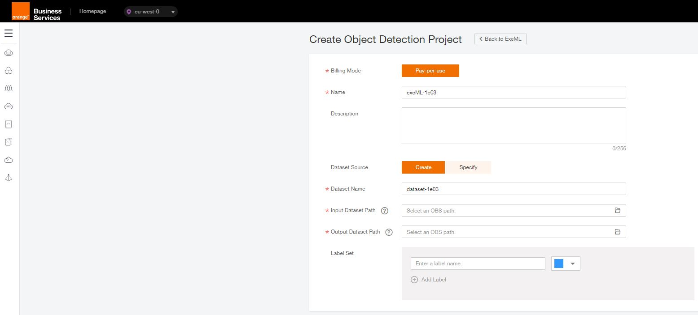

# ModelArts Mascot (Yunbao) Detection (Using ExeML for Object Detection)

ModelArts provides ExeML for service developers, freeing you from model development and parameter tuning. With ExeML, you can finish an AI development project in just three steps, including data labeling, auto training, and service deployment.

This section provides an example of how to detect Yunbao, the mascot of ModelArts, to help you quickly get started with ModelArts. This example is an object detection project. By using the built-in Yunbao image dataset, the system automatically trains and generates a detection model, and deploys the generated model as a real-time service. After the deployment is completed, you can use the real-time service to identify whether an input image contains Yunbao.

Before you start, carefully complete the preparations described in Preparations. To use ExeML to build a model, perform the following steps:

Step 1: Prepare Data
Step 2: Create an Object Detection Project
Step 3: Label Data
Step 4: Generate a Model with ExeML
Step 5: Deploy the Model as a Real-Time Service
Step 6: Test the Service

## Preparations

You have registered with Flexible Engine Cloud account and checked the account status before using ModelArts. 

You have configured access authorization for the current account. For details, see Configuring Agency Authorization. For users who have been authorized using access keys, you are advised to clear the authorization and configure agency authorization.

OBS buckets and folders are ready. For details about how to create OBS buckets and folders, see Creating a Bucket and Creating a Folder. For normal data access, ensure that the created OBS bucket and ModelArts are in the same region.

Data management is required for creating ExeML projects. Therefore, you need to obtain the permission to access OBS from the Data Management module before using ExeML.

On the ModelArts management console, choose Data Management > Datasets in the left navigation pane. On the page that is displayed, click Service Authorization to apply for permission authorization. If you log in using an account, a dialog box is displayed, asking you to accept the authorization. For an IAM user (sub-account), authorization performed by the master account or a user with the Admin permission is required.

## Step 1: Prepare Data

ModelArts provides a sample dataset of Yunbao named Yunbao-Data-Custom. This example uses this dataset to build a model. Perform the following operations to upload the dataset to the OBS directory test-modelarts/dataset-yunbao created in preparation.

If you want to use your own dataset, skip this step, upload the dataset to the OBS folder, and select this directory in Step 2: Create an Object Detection Project.

Download the Yunbao-Data-Custom dataset to the local PC. Get Data from https://modelarts-labs.oss.eu-west-0.prod-cloud-ocb.orange-business.com/dataset-yunbao/zip-data/Yunbao-Data-Custom.zip

Decompress the Yunbao-Data-Custom.zip file to the Yunbao-Data-Custom directory on the local PC.
Upload all files in the Yunbao-Data-Custom folder to the test-modelarts/dataset-yunbao directory on OBS in batches. For details about how to upload files, see Uploading a File.
The obtained dataset has two directories: eval and train. The data stored in train is used for model training, and the data stored in eval can be used for model prediction.

## Step 2: Create an Object Detection Project

1. On the ModelArts management console, click ExeML in the left navigation pane.

2. In the Object Detection box, click Create Project. On the Create Object Detection Project page that is displayed, enter a project name and a dataset name, and select an input dataset path. The OBS path of the Yunbao dataset is /test-modelarts/dataset-yunbao/train/. Select an empty directory in Output Dataset Path.

 

---
**NOTE**

The Yunbao dataset has two directories: eval and train. Select the data in the train directory for training. If the upper-layer directory of train is selected, an error message is displayed, indicating that OBS has invalid data. As a result, the project will fail to create.
---

3. Click Create Project. The object detection project is created. After the project is created, the ExeML > Label Data page is displayed and data source synchronization is automatically performed.

## Step 3: Label Data
For an object detection project, labeling data is to locate an object in an image and assign a label to the object. The labeled data is used for model training. In the Yunbao dataset, part of data has been labeled. You can label the unlabeled data for trial use.

Data source synchronization is automatically performed when you create an ExeML project. Data source synchronization takes a certain period of time. If the synchronization fails, you can click Synchronize Data Source to manually execute the synchronization.

On the ExeML > Label Data page, click the Unlabeled tab. All unlabeled images are displayed. Click an image to go to the labeling page.

Figure 2 Image labeling for object detection

Left-click and drag the mouse to select the area where Yunbao is located. In the dialog box that is displayed, enter the label name, for example, yunbao, and press Enter. After the labeling is complete, the status of the image changes to Labeled in the left Image Catalog pane.

You can select another image from the image catalog in the lower part of the page and repeat the preceding steps to label the image. If an image contains more than one Yunbao, you can label all. You are advised to label all images in the dataset to train a model with better precision.

After all images in the image directory are labeled, click ExeML in the upper left corner. In the dialog box that is displayed, click OK to save the labeling information. On the Labeled tab page, you can view the labeled images and view the label names and quantity in the right pane.

## Step 4: Generate a Model with ExeML

1. After data labeling is completed, click Train in the upper right corner of the data labeling page. In the Training Configuration dialog box that is displayed, set related parameters by referring to Figure 3.

Figure 3 Setting training parameters

2. Click Next. On the configuration page that is displayed, confirm the specifications and click Submit to start auto model training. The training takes a certain period of time. If you close or exit the page, the system continues training until it is completed.
After the training is completed, you can view the training details on the page, such as the accuracy, evaluation result, custom parameters, and class statistics.

Figure 4 Model training

## Step 5: Deploy the Model as a Real-Time Service

l. On the Train Model tab page, wait until the training status changes to Completed. Click Deploy in the Version Manager pane.

Figure 5 Deploying a service

2. In the displayed Deploy dialog box, set Specifications and Auto Stop, and click OK to deploy the object detection model as a real-time service.
If you select free specifications, you do not need to set Auto Stop, because the node will be stopped one hour later.

Figure 6 Deployment settings

3. After the deployment is started, the system automatically switches to the Deploy Service tab page. This page displays the deployment progress and status.
The deployment takes a certain period of time. After the deployment is completed, the status in the Version Manager pane changes to Running.

Figure 7 Successful deployment
Figure 6 Deployment settings

## Step 6: Test the Service

After the model is deployed, you can test the service using an image.

On the Deployment Online tab page, select a running service version, and click Upload to upload a local image.

Figure 8 Uploading an image

Select an image from a local environment. The image must contain Yunbao. Click Predict to perform the test.
After the prediction is completed, the label name yunbao, location coordinates, and confidence score are displayed in the prediction result pane on the right. In the prediction result, detection_boxes indicates the location of the object, detection_scores indicates the detection score of yunbao.

If the model accuracy does not meet your expectation, add images on the Label Data tab page, label the images, and train and deploy the model again.

---
**NOTE**

A running real-time service keeps consuming the resources. If you do not need to use the real-time service, you are advised to click Stop in the Version Manager pane to stop the service and avoid unnecessary billing. If you want to use the service again, click Start.

---

Get Data from https://modelarts-labs.oss.eu-west-0.prod-cloud-ocb.orange-business.com/dataset-yunbao/zip-data/Yunbao-Data-Custom.zip
