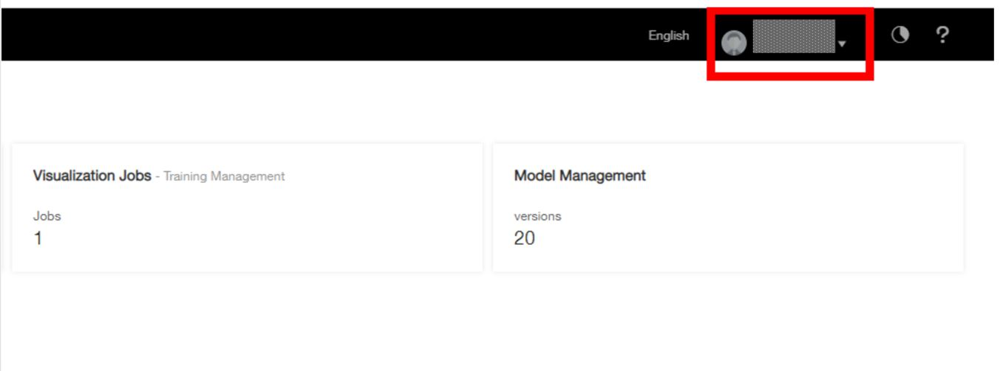
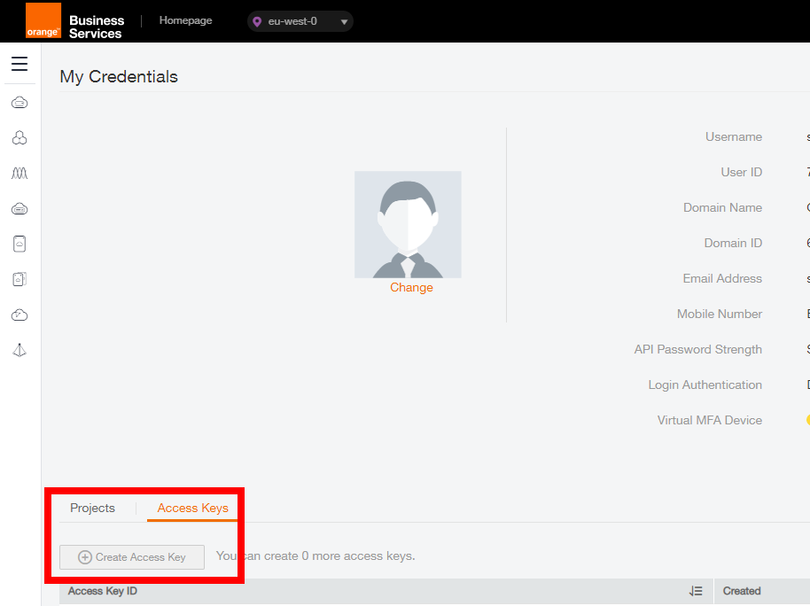
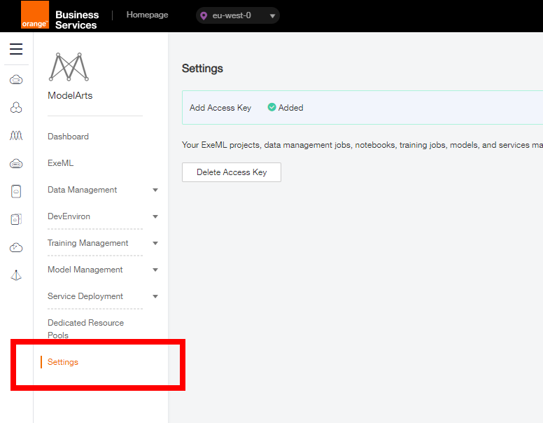

#  Preparations

## Obtaining the Access Key and configuring ModelArts

When using the Training Jobs, Model Management, and Notebooks functions of ModelArts, you need to use Object Storage Service (OBS) to store data. Therefore, before using ModelArts to develop AI models, obtain access keys and add them on the ModelArts management console.

### Obtaining an Access Key

1. On the ModelArts management console, hover over the username in the upper right corner and choose My Credentials from the drop-down list.

 

2. On the My Credentials page, choose Access Keys > Create Access Key.

 

3. In the Create Access Key dialog box that is displayed, enter the verification code received by SMS or email.
4. Click OK and save the access key file as prompted. The access key file is saved in the default download folder of the browser. Open the credentials.csv file to view the access key (Access Key Id and Secret Access Key).

### Adding an Access Key

1. Log in to the ModelArts management console. In the left navigation pane, click Settings. The Settings page is displayed.
2. Click Create Access Key and enter the obtained access key.
  – AK: Enter the value of the Access Key Id file in the key file
  – SK: Enter the value of the Secret Access Key file in the key file
3. Click OK. The access key is added.

 

## Creating an OBS Bucket

ModelArts uses FE OBS service to store data and model backups and snapshots, achieving secure, reliable, and low-cost storage. OBS is the Object Storage Service on Orange Flexible Engine Cloud. It is not the same OBS for Orange Business for Service at this context : ) Before using ModelArts, we need to create an OBS bucket and folders for storing data.

You can of course use an existing bucket for storing data. But please make sure it is the 2nd generation Bucket and it is not in the warm or cold mode. If you are not so sure about its parameters, by simply creating a new bucket we can make 100% sure it works
